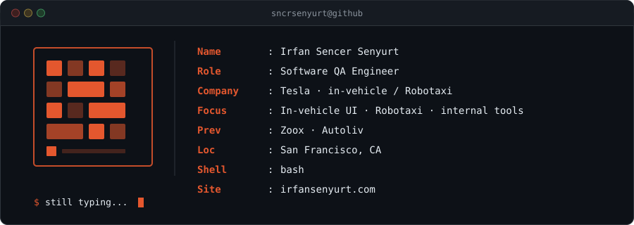

<!-- Dark navy + burnt-orange · terminal card + LinkedIn-based copy -->

  

  

  <strong>Software QA @ Tesla</strong> — in-vehicle UI &amp; Robotaxi

<ul>
  <li>3 internal tools used by 4 teams (cut test time 15–40%)</li>
  <li>Automation nodes + Ruby/Tidal suites · Jenkins/Docker CI</li>
  <li>Turkish localization for in-vehicle UI</li>
</ul>

  Prev: Zoox · Autoliv

  
  &nbsp;
  
  &nbsp;
  

 

  
  
  
  
  
  
  
  
  
  
  
  

